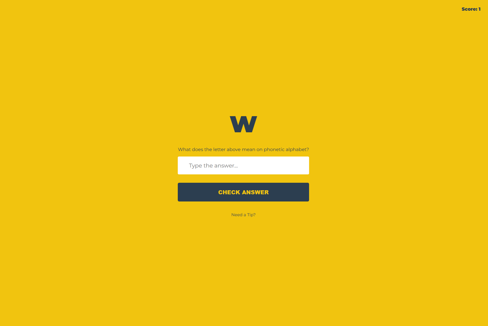
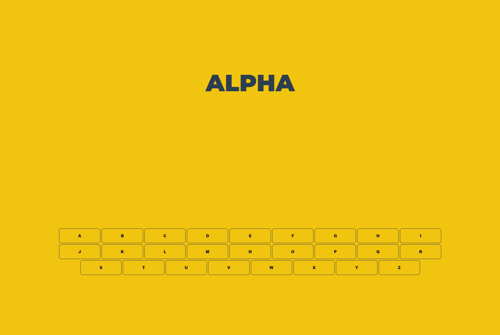

# NATO phonetic alphabet GAME

The (International) Radiotelephony Spelling Alphabet, commonly known as the NATO phonetic alphabet, is the most widely used set of clear code words for communicating the letters of the Roman alphabet. Technically a radiotelephonic spelling alphabet, it goes by various names, including NATO spelling alphabet, ICAO phonetic alphabet and ICAO spelling alphabet. The ITU phonetic alphabet and figure code is a rarely used variant that differs in the code words for digits.

## Learn the alphabet 
With this mini game and score high to be the smartest guy in the jungle. If you need help, click on the **NEED HELP?** link to learn new words.

Have fun and happy coding! ;)
